# NUI @ UMN
Geoffrey (Jeff) Peterson

University of Minnesota Libraries

---
Primo Show & Tell: August, 2017

===
Go Live: Wednesday, July 26, 2017
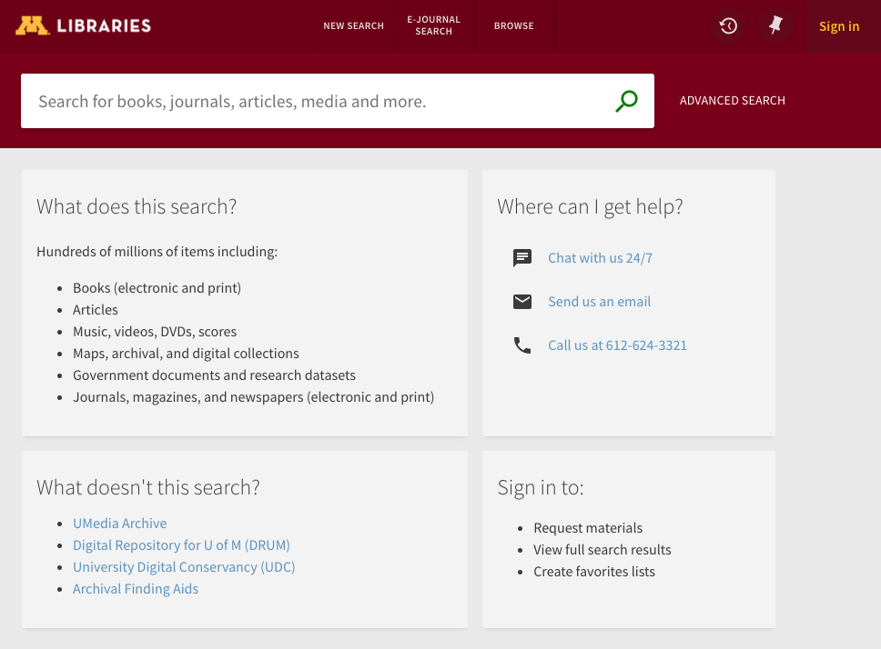 
<!-- .element height="75%" width="75%" -->

Notes: 
We have 4 campuses, all of them are now on the new UI. Here on the Twin Cities campus we went live with the new UI on July 26. So far, we've had a little over 30,000 unique users have used the new UI. 

====
## Feedback

* "simple", "clean", "modern" appearance <!-- .element class="icon smile" -->
* prominence of "send to" actions  <!-- .element class="icon smile" -->
* item information in one page (vs separate tabs)  <!-- .element class="icon smile" -->
* performance (relative to old UI) <!-- .element class="icon frown" -->
* use of animations <!-- .element class="icon frown" -->
* device support <!-- .element class="icon frown" -->
* no results (and other ephemeral oddities)<!-- .element class="icon worry" -->

Notes: 
"no results" is sort of an ephemeral problem that some users have reported. There's a related fix in the August release, so were hoping this will not be resolved soon. 

Some users have also encountered situations where none view labels or icons won't load properly until they clear their browser's cache. 

===
## Customization

+++
### Google Analytics Service

* GA is a little tricky with single-page apps
* You must decide when to record a new page view

```javascript
// Log a pageview event whenever the location bar changes.
$rootScope.$on('$locationChangeSuccess', function() {
  $window.ga('send', 'pageview', {location: $location.url()});
});
```

Notes: 
Listening to the `$locationChangeSuccess` event depends on the fact that Primo is currently using a pre-1.0 version of ui-router. Newer versions of ui-router emit different events to signal a successful state change. 

+++
### HathiTrust Availability
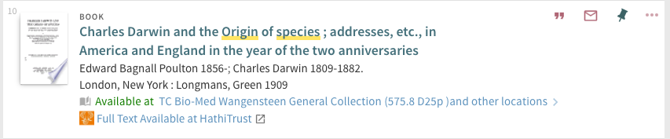

https://github.com/UMNLibraries/primo-explore-hathitrust-availability
<!-- .element style="font-size:.6em" -->

Notes:
It's important at our institution to highlight HathiTrust as a resource, but historically we've not been satisfied with the way HathiTrust journals are represented in PCI. (We've yet to fully evaluate the recent changes to HathiTrust journals in PCI though.)

+++
### Blogger Notification Service
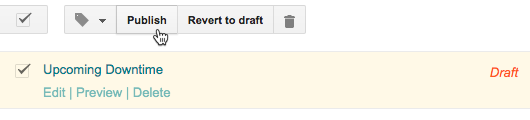

&darr; <!-- .element style="margin: -20px;" -->

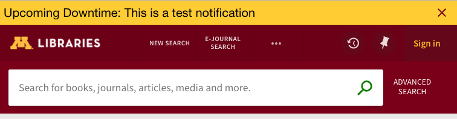

(does not show dismissed notifications)

Notes: 
Notification are displayed in `mdToast` directives. The only problem with this is that mdToast notifications get hidden when user open the full display view (which is implemented with an mdDialog). 

+++
### ILLiad Link in Account Overview
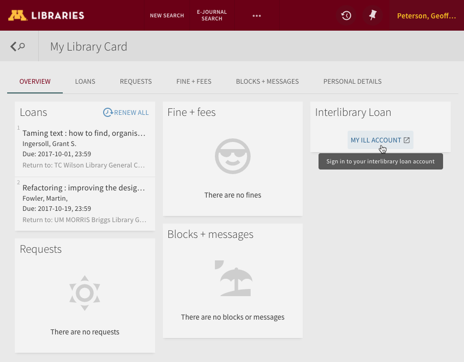
<!-- .element height="75%" width="75%" -->

Notes: 
We use ILLiad, and when conducting usability testing with some inter-library loan scenarios, we found that many users were going to the Primo Account page when attempting to renew their ILL loans. 

The Account Overview section doesn't have a convenient `after` directive to hook into, so this relies on some icky DOM manipulation. 

+++
### "Haven't Found" Suggestions
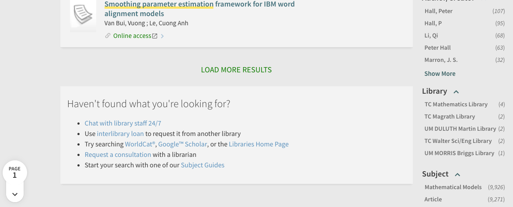

+++
### Embedded Chat Directive

```html
<!-- dispalys chat service in an mdDialog when clicked -->
<a show-chat-on-click href=''>Chat with us 24/7</a>
```

&darr; <!-- .element style="margin: -20px;" -->

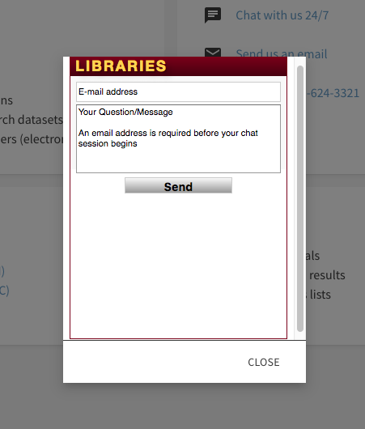
<!-- .element height="40%" width="40%" -->

Notes: 
We wanted to add an embedded chat box in a few places, so I created a `showChatOnClick` attribute directive that can be added to any element. Clicking on the element presents our chat window in an `mdDialog`. 

+++
### FRBRless Permalink Directive 

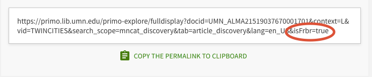 

&darr; <!-- .element style="margin: -20px;" -->

 


+++
### FRBRless Permalink Directive 

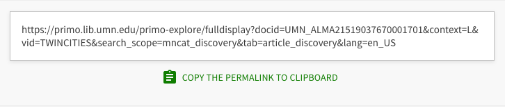 

&darr; <!-- .element style="margin: -20px;" -->

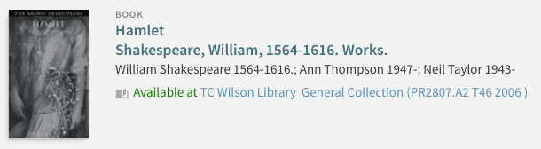 

+++
#### Waiting for the Alma IFrame to Load
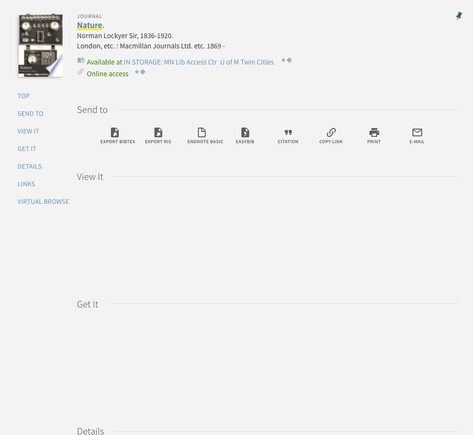
<!-- .element height="450" width="450" -->
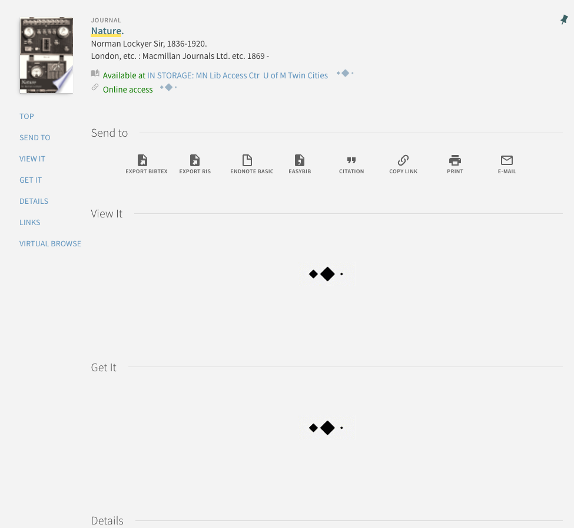
<!-- .element height="450" width="450" class="fragment"-->

Notes: 
It can be confusing to users when the Alma iframe doesn't load immediately, so we added a "loading diamonds" background GIF so that user know to expect that content will load eventually.

+++
### My Account Redirect Service 
* Problem: create deep links to My Library Card that work consistently with new, existing, and expired sessions
* ~~Solution~~ Crude Hack: when a URL contains a `redirect=myaccount` parameter, this service re-initializes expired sessions before transitioning to the `account` state

Notes:
In order to provide consistent deep links to the "My Library Card" page, we need to properly handle 3 scenarios: 1) no session, 2) active session, and 3) expired session. Every PDS+Primo link that Ex Libris suggested seemed to fail in at least one of those scenarios, so we ended up implementing this service as a workaround. 

===
## Working with the new UI
Some Observations

+++
### PushTo Plugins
No longer supported? 

<span role="img" aria-label="confused face">&#x1F615;<span>

Notes:

+++
### Injecting Primo Services
Prior to the May release, this did not work, but it seems to work now.

<!--<span role="img" aria-label="smiling face">&#x1F642;<span>-->

```javascript
RedirectService.$inject = [
  '$location', 
  '$window', 
  '$state', 
  '$timeout',
  '$translate',
  'SessionTimeoutService', // Primo Service
];
```

+++
### `--browserify`

* added in [January, 2017](https://github.com/ExLibrisGroup/primo-explore-devenv/pull/28)
* nice option if you want to use ES6-style modules 
* creating custom ODF modules that work well with both the standard and Browserify builds is tricky

Notes: 
* copy and concatenate vs explicit import / require
* with Browserify, imported modules are *not* automatically transpiled to ES5 (IE 11 doesn't even support arrow functions)

===
## Looking Ahead
It would be nice if...

+++
### JS Minification/Uglification

Notes: 
We're doing this locally, and it's reduced the size of our custom JavaScript file considerably. I've been meaning to submit a PR, but there seems to be a bit of a backlog at the moment: https://github.com/ExLibrisGroup/primo-explore-devenv/pulls
This might break some custom modules if you're not using DI best practices. 

+++
### ODF Documentation

* [Open wiki pages](https://github.com/ExLibrisGroup/primo-explore-devenv/issues/56) in the ODF GitHub repo? 
* Best practices for sharing code?
* Consistent versioning & tagging for ODF
* Changes to Angular versions in Primo release notes (or major changes to dependencies too)

Notes: 
* There are a few open requests to updates the documentation on GitHub. Maybe the repository's wiki pages should be opened up so that anyone change make revisions.
* Not overwriting the prmAfter\* components? How to create modules that work will with both the Browserify and concatenation builds (or maybe standardize on one build type)?


+++
### Support for PushTo Plugins 
Is EL trying to phase out server-side Java plugins?

+++
### ~~OPAC via Primo~~ 
### Alma via IFrame
Why are we still doing this?

Notes: 
* no more iframes, please
* difficult to customize
* relies on 3rd-party cookies
* presents accessibility and usability challenges 
* would ideally like to see some sort of OvP-like delivery feature for Alma 
  (similar to what's available with Aleph & Voyager)

+++
### Primo Proxy for External APIs
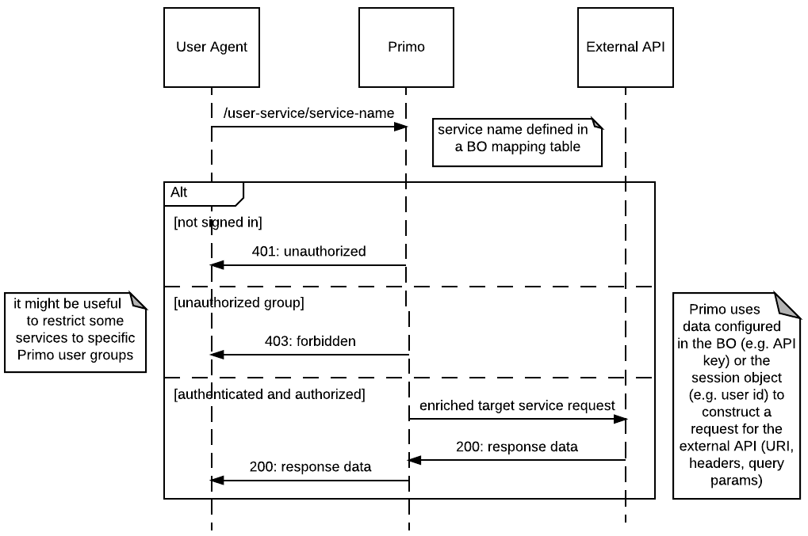 
<!-- .element height="88%" width="88%" -->

Notes: 
Originally I was thinking of the Alma APIs, but ideally this would work with any external service. 

 Problems with calling eternal APIs from the client-side: 
  * same-domain restrictions 
  * don't want to expose API keys in the browser
  * authentication and authorization for some services
* Setting up a CORS proxy service on you own web server can address the first 2, but auth is still a little tricky. 
* Primo already uses a JWT for auth, so why not build the proxy into Primo itself?
* Back office configuration could be used to define proxy endpoint and mappings to the target service
* offers better privacy for users (vs direct client-side requests to 3rd-party services)


===
## Contact

[IGeLU/ELUNA Slack](https://igelu-eluna-siwg.slack.com/): @gpeterso

[gpeterso@umn.edu](mailto:gpeterso@umn.edu)

